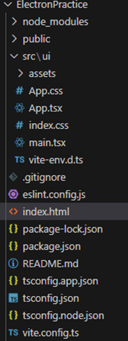

# Electron Practice

A sample Electron application integrated with Vite, React, and TypeScript.

---

## **Project Overview**

This project sets up an Electron app using Vite for fast development, React for UI, and TypeScript for type safety. It includes instructions for building and packaging the application for Windows and Linux using Electron Builder.

---

## **Installation Steps**

### **1. Setup Vite with React and TypeScript**
1. Initialize the Vite project:
   ```bash
   npm install vite
   choose the react+typescript.

2. Make a UI folder where you can add all the root directory.


3. make change in index.html file


4. remove public folder
  -also remove all the neccessary thing present in app.js.

5. run command : npm run build.
6. then make changes in vite.config.ts


 ## **Installation Elctron**
1. npm install --save-dev electron
2. create electron folder and the create a file.
3. Then add 


4. this is the package.json update file.
{
  "name": "electronpractice",
  "private": true,
  "version": "0.0.0",
  "type": "module",
  "main" : "dist-electron/main",
  "scripts": {
    "dev:react": "vite",
    "dev:electron": "electron .",
    "build": "tsc -b && vite build",
    "lint": "eslint .",
    "preview": "vite preview",
    "transpile:electron" : "tsc --project src/  electron/tsconfig.json"
  },
  "dependencies": {
    "react": "^18.3.1",
    "react-dom": "^18.3.1"
  },

  "devDependencies": {
    "@eslint/js": "^9.15.0",
    "@types/react": "^18.3.12",
    "@types/react-dom": "^18.3.1",
    "@vitejs/plugin-react": "^4.3.4",
    "electron": "^33.2.1",
    "eslint": "^9.15.0",
    "eslint-plugin-react-hooks": "^5.0.0",
    "eslint-plugin-react-refresh": "^0.4.14",
    "globals": "^15.12.0",
    "typescript": "~5.6.2",
    "typescript-eslint": "^8.15.0",
    "vite": "^6.0.1"
  }
}

## **Electron-builder for every device**
install -> npm i --save-dev electron-builder
1. make a file and name that as electron-builder.json


2. add these things in package.json file.


3. then run it 
-here it is the command :  npm run dist:win for windows.

4. for linux user 


5. If not run and showing error for add email or other thing then add in package.json file.


6. add package
  npm install cross-env

7. then add a file name is util.js under electron

export function isDev():boolean {
    return process.env.NODE_ENV === 'developement'
}

8. then add some line of code in main.ts

import { app, BrowserWindow } from 'electron';
import path from 'path';
import { isDev } from './util.js';

type test = string;

app.on('ready', () => {
    const mainWindow = new BrowserWindow({})

    if (isDev()) {
        mainWindow.loadURL('http://localhost:5123');
    }
    else {
        mainWindow.loadFile(path.join(app.getAppPath(), '/dist-react/index.html'))
    }

})

9. add package.json
"dev:electron": "cross-env NODE_ENV=developement electron .",

## **Run parallel application**
1. install : npm i --save-dev npm-run-all
2. then change in packagejson file 

 "dev":"npm-run-all --parallel dev:react dev:electron",

 


## **Reading System Resources**
1. install : npm i --save-dev @types/os-utils
2. if its not work then install : npm i --save-dev os-utils
3. then make a file name is resourceManager.ts under electron folder.
4. add this code snippet for know the cpu,ram,storagedata usages

import osUtils from 'os-utils';

const POLLING_INTERVAL = 500;

export function pollResources() {
    setInterval(async () => {
        const cpuUsage = await getCpuUsage();
        const ramUsage =  getRamUsage()
       console.log({cpuUsage,ramUsage});
    }, POLLING_INTERVAL)
}

export function getStaticData(){
    const totalStorage = getStorageData().total;
    const cpuModel = os.cpus()[0].model;
    const totalMemoryGB = Math.floor(osUtils.totalmem()/1024);

    return  {
        totalStorage,
        cpuModel,
        totalMemoryGB
    }
} 

function getCpuUsage(){
    return new Promise((resolve)=>{
        osUtils.cpuUsage(resolve);
    });
}

function getRamUsage(){
    return 1-osUtils.freememPercentage();
}

function getStorageData (){

    const stats = fs.statfsSync(process.platform === 'win32' ? 'C://' : '/');
    const total = stats.bsize * stats.blocks;
    const free = stats.bsize * stats.bfree;

    return{
        total:Math.floor(total / 1_000_000_000),
        usage: 1 - free / total,
    }
}


## **Communicating with UI**

**image add**
1. add file pathResolver.ts
 
 import path from 'path';
 import {app} from 'electron';
 import {isDev} from './util.js';


export function getPreloadPath(){
    return path.join(
        app.getAppPath(),
        isDev()? '.' : '..',
        'dist-electron/preload.cjs'
    )
}


2. add another file as preload.cts data here 

import { contextBridge, ipcRenderer } from "electron";

contextBridge.exposeInMainWorld("electron", {
  subscribeStatistics: (callback: (statistics: any) => void) => {
    const listener = (_: any, stats: any) => {
      callback(stats);
    };

    ipcRenderer.on("statistics", listener);

    // Return a cleanup function to remove the listener
    return () => {
      ipcRenderer.removeListener("statistics", listener);
    };
  },
  getStaticData: () => {
    console.log("Static data requested");
  },
});

3. then changes here

import { app, BrowserWindow } from 'electron';
import path from 'path';
import { isDev } from './util.js';
import {pollResources} from './resourceManager.js';
import { getPreloadPath } from './pathResolver.js';

type test = string;

app.on('ready', () => {
    const mainWindow = new BrowserWindow({
        webPreferences:{
            preload: getPreloadPath(),
        },
    })
     if (isDev()) {
        mainWindow.loadURL('http://localhost:5123');
    }
    else {
        mainWindow.loadFile(path.join(app.getAppPath(), '/dist-react/index.html'))
    }

    pollResources(mainWindow);

})


4. then show put this data in main.ts

  useEffect(() => {
    // Subscribing to statistics and logging the result
    const unsubscribe = window.electron.subscribeStatistics((stats) => {
      console.log(stats);
    });

    // Cleanup function to unsubscribe on component unmount
    return () => {
      if (unsubscribe) unsubscribe();
    };
  }, []);


5. and make a file global.d.ts

export {};

declare global {
  interface Window {
    electron: {
      subscribeStatistics: (callback: (statistics: any) => void) => () => void;
      getStaticData: () => void;
    };
  }
}
